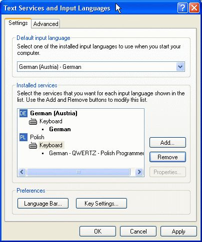

# quertz-pl-keyboard
Polish Programmers Layout for German QWERTZ keyboard

## Windows

Polish Programmers keyboard driver is used to input special polish characters like ą, ń, ć, ł, ó using AltGr modifier key and corresponding latin character a ,n, c, l, o.

In Windows this driver is made based on the QWERTY keyboard layout and using it with the German QWERTZ keyboard layout is very confusing because the position of slashes, braces, etc. is quite different than in classic QWERTY keyboard layout.
The situation in Windows 7/10 is better, because Polish Programmers keyboard driver works with QWERTY keyboard layout except the € character which is mapped at the place where polish character ę is expected to be found.
Because I could not found any solution satisfying my needs I decided to make my own keyboard driver (MSKLC)[http://msdn.microsoft.com/en-us/goglobal/bb964665.aspx]- Microsoft Keyboard Layout Creator. This is very easy and straight forward tool, so making new keyboard driver takes really few minutes.

The Keyboard driver I prepared has also another advantage. I can type german and polish special characters without switching between keyboard layouts.
In order to resolve the issue with the € character I mapped the key R to input € and the combination AltGr-e produces polish ę.

The installation program with could be downloaded .

Unzip it in the directory of your choice and start setup.exe. The new keyboard will be added to the input services in the Regional and Language Options:

